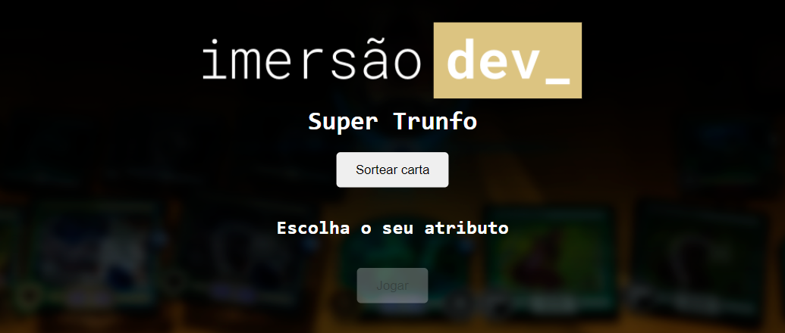
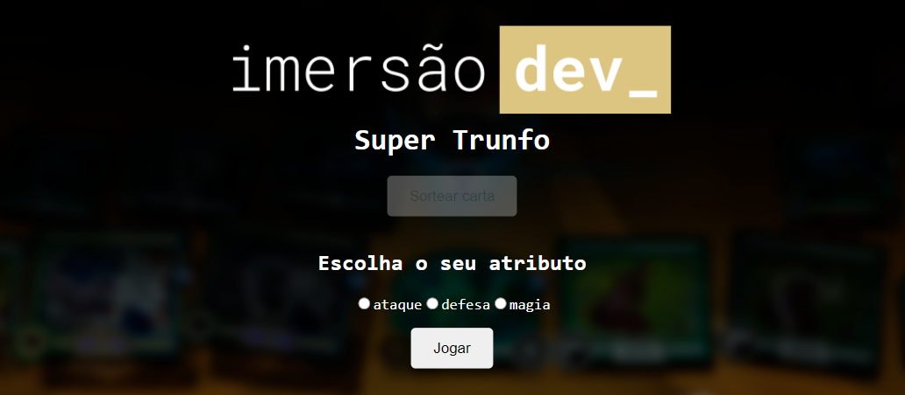

<h4 align="center">Trunfo é um jogo de cartas. Neste programa, focamos no desenvolvimento da lógica do jogo do zero, desde a criação das cartas, sorteio das cartas, interações com usuário, e definindo um vencedor. <a href="https://codepen.io/karengiovanna/pen/vYgmadp" target="_blank">Veja aqui</a>.</h4>

  
    

## Projeto inicial feito durante a Imersão Dev

## Projeto inicial feito durante a Imersão Dev

